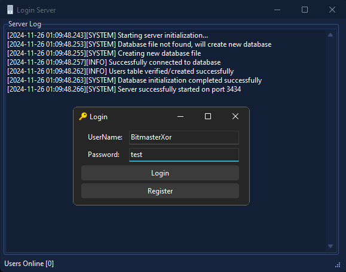

# 🔒 Delphi NetCom7 Client-Server Database Login and Register Application with SQLite & 3DES Encryption

A Delphi project that implements a secure client-server application using **NetCom7** components. The server uses a SQLite database to store encrypted user credentials, while all communication is encrypted with **LockBox2 3DES** for enhanced security.

<p align="center">
  
</p>

## 📋 Features

- **Client Login and Registration**: 
  - Clients can register with a username and password, which are encrypted and securely stored on the server.
  - Existing users can log in to authenticate against the server.

- **Encrypted Communication**: 
  - All socket communication between the client and server is encrypted using LockBox2's 3DES encryption.

- **Secure User Credential Storage**:
  - User credentials (username, password, and creation time) are stored in a local SQLite database (`DB.db`) using FireDAC components.

- **Database Schema**:
  - Table structure:
    - **USERNAME**: The user's unique username.
    - **PASSWORD**: The 3DES-encrypted password.
    - **TIME_CREATED**: Timestamp of account creation.

- **Socket Management**:
  - Uses NetCom7 for reliable socket-based communication between the client and server.

## 🔍 Overview

- **Client Features**:
  - Register new users by sending encrypted username and password to the server.
  - Log in by validating credentials stored on the server.

- **Server Features**:
  - Handles multiple client connections for registration and login.
  - Encrypts and stores user credentials securely in a SQLite database.
  - Logs client activities and system events for monitoring.

## 🛠️ Requirements

### 🔧 Tools and Components

1. **Delphi RAD Studio**:  
   - IDE required to compile the client and server applications.  
   - [Delphi RAD Studio Download](https://www.embarcadero.com/products/delphi)  

2. **NetCom7 Components**:  
   - Used for implementing socket-based communication.  
   - [NetCom7 GitHub Repository](https://github.com/DelphiBuilder/NetCom7)  

3. **LockBox2**:  
   - Provides 3DES encryption for secure communication and data storage.  
   - [LockBox2 GitHub Repository](https://github.com/jarto/lockbox2)  

4. **FireDAC Components**:  
   - Required for database operations with SQLite.  
   - Bundled with Delphi RAD Studio. Ensure FireDAC libraries are installed and linked to your project.  

### 🗃️ Database

- Ensure the SQLite database file (`DB.db`) is located in your Documents folder.  
- Use the provided database schema or create the required table manually:
  ```sql
  CREATE TABLE USERS (
      USERNAME TEXT PRIMARY KEY,
      PASSWORD TEXT,
      TIME_CREATED DATETIME DEFAULT CURRENT_TIMESTAMP
  );
  ```

## 🧩 Usage

1. **Server Setup**:
   * Install and configure the required components.
   * Run the server application to start listening for client connections.

2. **Client Setup**:
   * Install the required components.
   * Run the client application.
   * Use the interface to register a new user or log in with existing credentials.

3. **Encryption**:
   * Ensures all traffic and credentials are securely encrypted using the built-in LockBox2 3DES implementation.

## 📜 License

This project is provided as freeware. Use it at your own risk for educational and research purposes.

## 📧 Contact

Developed with ❤️ by BitMasterXor
